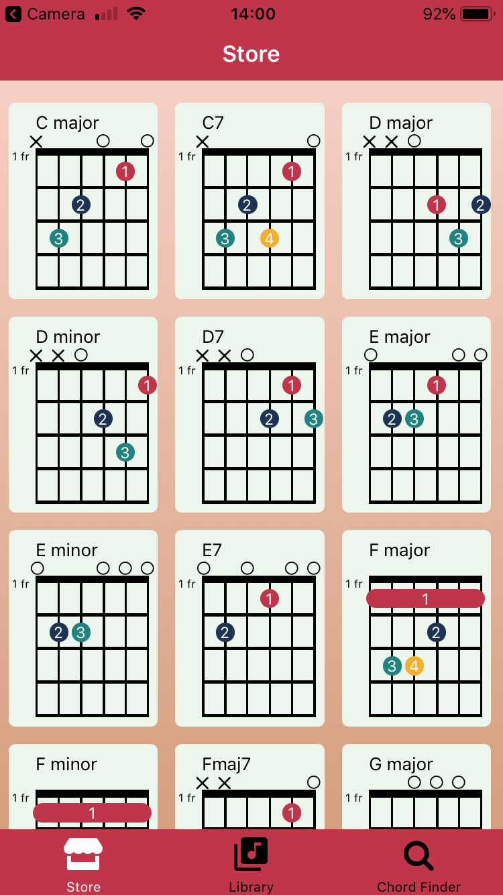
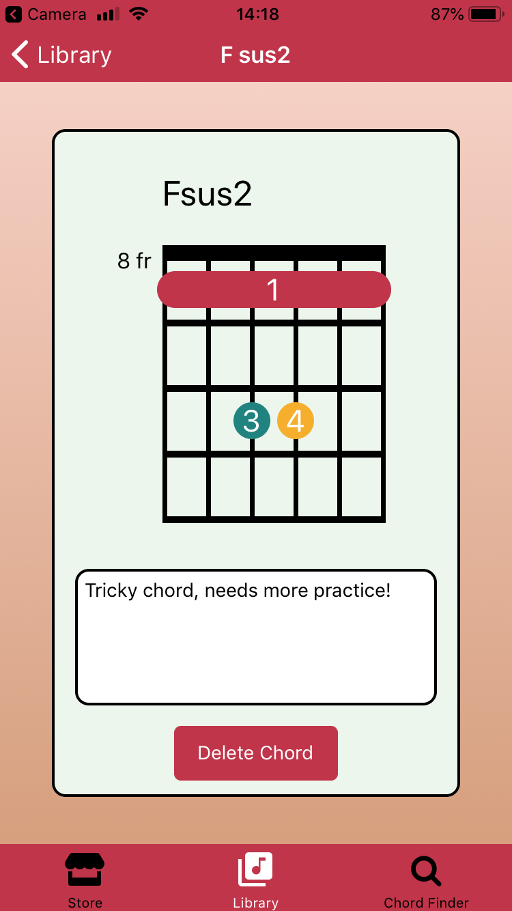
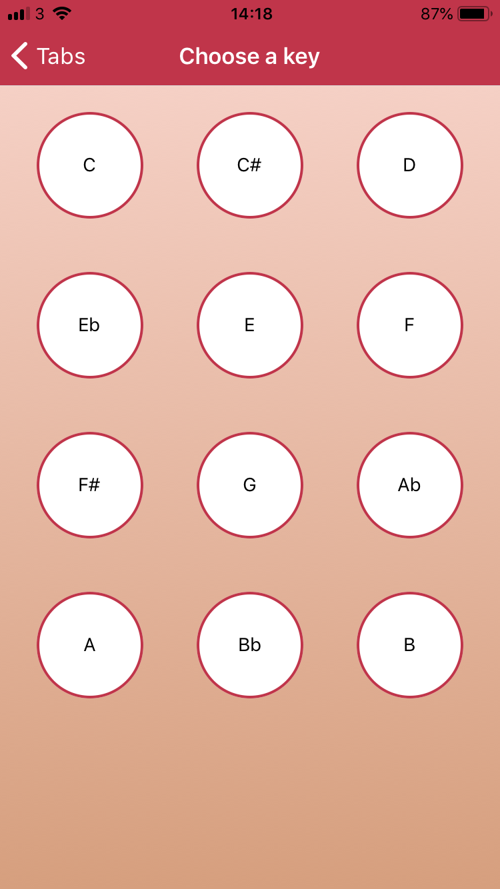
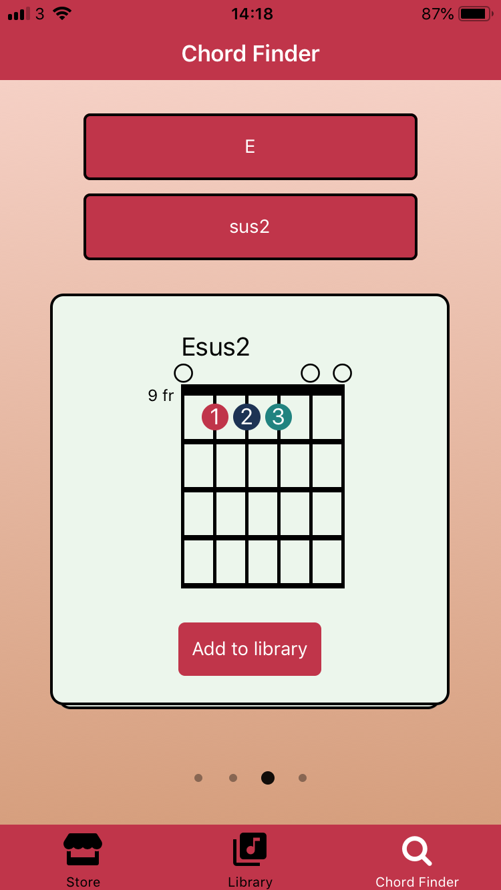

# Choord

Choord is a mobile (iOS) app that helps beginner guitarists learn and discover new chords. Users can scroll through a list of common beginner friendly chords in the "Chord Store" or search for the chord they wish to learn from a database of over 2000 chords. Once the correct chord is found, the user can add the chord to their library.

<kbd></kbd><kbd></kbd>

<kbd></kbd><kbd></kbd>

## Getting Started

Before you continue with the installation make sure you have: git Node and npm installed on your machine. Furthermore, install the Expo development environment with

```bash
npm install -g expo-cli
```

## Installation

1. Clone the repo

```bash
git clone https://github.com/MSrotyr/Choord
cd Choord
```

2. Create a .env file in the App directory and insert the correct environment variables, listed in .env.example, for your machine. To find your LOCAL_IP_ADDRESS type 'ipconfig' into your terminal, use the value labelled 'IPv4 Address'. MONGO_URL defaults to 'mongodb://localhost:27017/choord' if omitted.

3. Add chords from json file to database

```bash
cd server
node uploadChord.js
```

4. Install backend server dependencies and run

```bash
cd server
npm install
npx nodemon
```

5. In a new terminal: Install app dependencies and run

```bash
cd App
npm install
npm start
```

6. Scan the barcode with the Expo app on your phone or follow the terminal instructions to load up the emulator on your machine.

# Built with

- [React Native](https://facebook.github.io/react-native) - Front end library for building user interfaces
- [React Navigation](https://reactnavigation.org) - Routing and _navigation_ for _React_ Native apps
- [Redux](https://redux.js.org) - Storage to share data inside the app
- [Expo](https://expo.io) - Build cross-platform native apps
- [Express](https://expressjs.com/) - Backend framework for Node.js
- [MongoDB](https://www.mongodb.com/cloud/atlas1) - NoSQL database
- [mongoose](https://mongoosejs.com/) - ODM for MongoDB

## Demonstration Video

[](https://youtu.be/ZYgws4idgDw)

## Author

Matthew Srotyr - [Github](https://github.com/MSrotyr) - [LinkedIn](https://www.linkedin.com/in/matthew-srotyr/)
